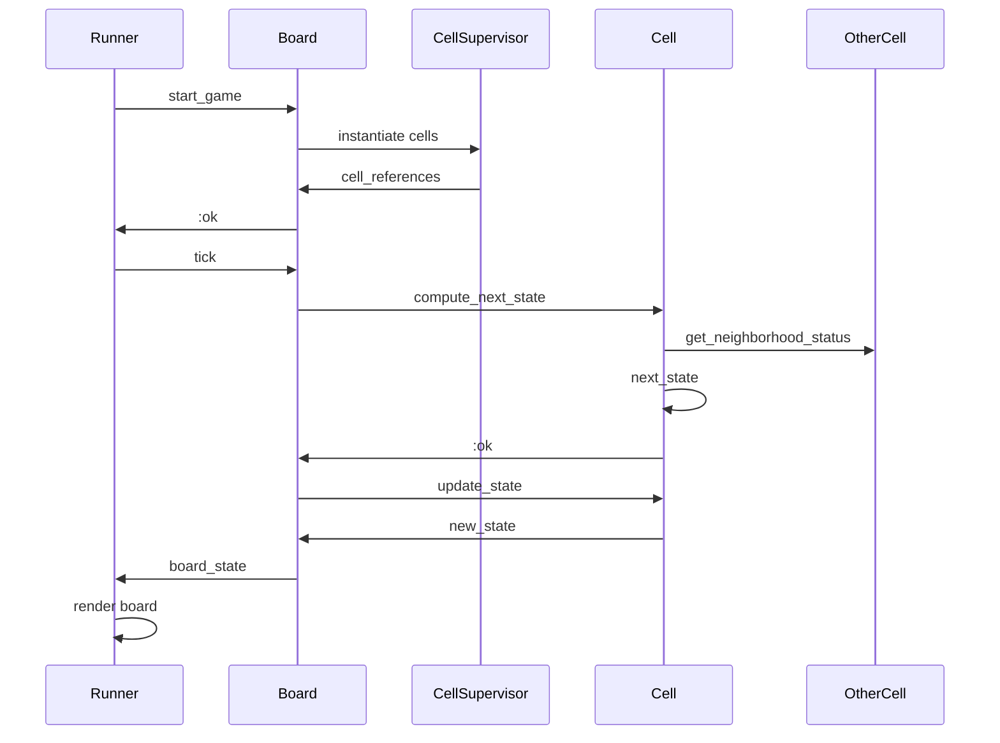

# Raifu

Conway's Game of Life with GenServers

## Description

This Conway's Game of Life implementation through GenServers mainly serves my learing purposes of OTP 
usage and testing, as well as build process of an Elixir app.

The game of life is composed by a single Board server of dimension x\*y that orchestrate x\*y Cell.
The Cells are dynamically instanciated through a CellSupervisor.
The Runner is used to trigger ticks on the Board and display the state of the game to the user.



## How to launch it

```bash
iex -S mix run --no-halt

# Then in iex, launch the game through the Runner
Raifu.Runner.start_game(6,6)
```

The Runner will then display the Game's board and update it upon each tick with the following format :


