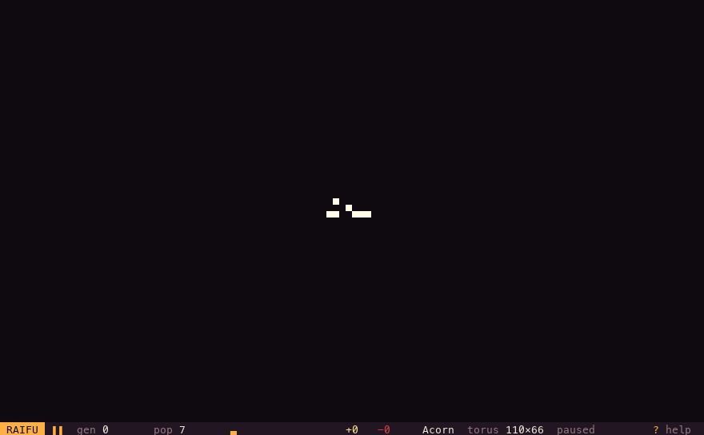
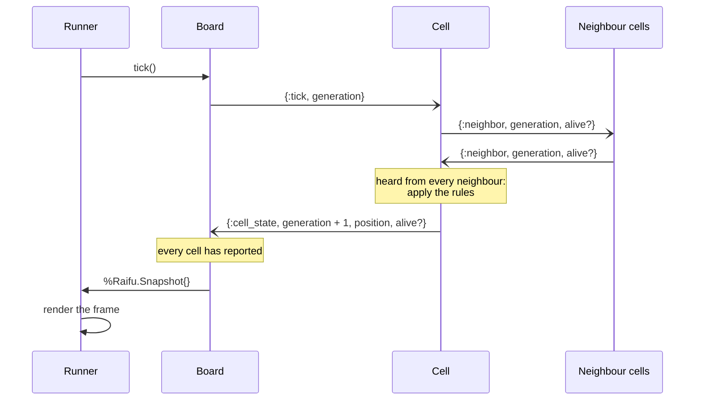

# Raifu

Conway's Game of Life with GenServers



## Description

This Conway's Game of Life implementation through GenServers mainly serves my learning purposes of OTP
usage and testing, as well as build process of an Elixir app.

Every cell of the board is its own process: a full screen board easily runs twenty thousand of them,
advancing concurrently, one generation at a time.

## How to play

Requires Elixir 1.19 and Erlang/OTP 28 (see `.tool-versions`).

```bash
mix deps.get
mix life
```

The board fills the terminal and wraps around its edges, like a torus. Live cells are colored after
their age: newborns glow, then cool down as they get older, so still lifes stand out from the chaos,
and dead cells leave a fading trail behind them.

```bash
mix life --pattern glider_gun --theme aurora    # a famous pattern, another color theme
mix life --width 60 --height 40 --bounded       # a smaller board, with edges
mix life --speed 30 --density 0.5               # faster, from a denser random soup
```

Patterns: `random`, `acorn`, `r_pentomino`, `glider_gun`, `gliders`, `spaceships`, `pulsars`, `line`,
`diehard` and `pentadecathlon`. Themes: `ember`, `aurora`, `neon`, `matrix` and `paper`.
See `mix help life` for every option.

| Key                | Action                     |
| ------------------ | -------------------------- |
| `space`            | pause / play               |
| `n` or `→`         | step one generation        |
| `+` `-` or `↑` `↓` | faster / slower            |
| `p`                | next pattern               |
| `r`                | reseed the current pattern |
| `t`                | next color theme           |
| `l`                | redraw, after a resize     |
| `?` or `h`         | show / hide the controls   |
| `q`                | quit                       |

The game can also be driven from IEx, where it is drawn over the shell:

```elixir
iex -S mix

iex> Raifu.Runner.start_game(60, 40, pattern: :acorn, theme: :neon)
iex> Raifu.Runner.command(:pause)
iex> Raifu.Runner.stop_game()
```

## How it works

```
Raifu.Supervisor (rest_for_one)
├── Raifu.CellRegistry     Registry, position → cell
├── Raifu.CellSupervisor   DynamicSupervisor
│   └── Raifu.Cell         × width × height
├── Raifu.Board            orchestrates the generations
└── Raifu.Runner           paces the game and draws it
```

The Board of dimension x\*y orchestrates x\*y Cells, dynamically instantiated through the CellSupervisor
and registered under their position. Cells never ask their neighbours anything, they tell them: on
each tick, every cell sends its state to its neighbours, and computes its next state once it has
heard from all of them. As no cell ever waits on another one, the whole board advances concurrently,
without any risk of deadlock. The Board replies to the Runner once every cell has reported back.


```mermaid
sequenceDiagram
    participant Runner
    participant Board
    participant Cell
    participant Neighbours as Neighbour cells

    Runner->>Board: tick()
    Board-)Cell: {:tick, generation}
    Cell-)Neighbours: {:neighbor, generation, alive?}
    Neighbours-)Cell: {:neighbor, generation, alive?}
    Note over Cell: heard from every neighbour:<br/>apply the rules
    Cell-)Board: {:cell_state, generation + 1, position, alive?}
    Note over Board: every cell has reported
    Board->>Runner: %Raifu.Snapshot{}
    Runner->>Runner: render the frame
```

The Runner keeps a `Raifu.View` of the game (cell ages, fading trails, statistics) that
`Raifu.Renderer` draws with half blocks: each character of the terminal shows two cells, stacked.

## Development

```bash
mix test    # the concurrent engine is checked against a plain implementation of the rules
mix lint    # formatting, compilation warnings and Credo
```
